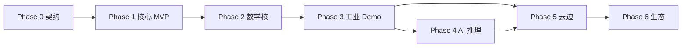

# sfi-platform 分阶段开发路线图

> Org: **StructForIndustry** · Repo: **sfi-platform** (monorepo)  
> 主战场领域: `domains/industrial-inspection` · 其余五领域 scaffold 并行占位

## 总览

| 阶段 | 名称 | 周期（估） | 核心交付 | 验收标准（摘要） |
|------|------|------------|----------|------------------|
| 0 | 契约与仓库基座 | 2–4 周 | schema、ABI、CI、文档 | 假插件通过契约集成测试 |
| 1 | 核心主库 MVP | 6–10 周 | hal-rs、core-bus、plugin-host | 单相机帧进入总线 |
| 2 | 数学核 + 技术插件 | 4–6 周 | math-kernel、vision-2d | Julia 进程处理共享内存帧 |
| 3 | 工业标杆领域包 | 6–10 周 | industrial-inspection 端到端 | AOI demo：检测 + API + 审计 |
| 4 | AI 推理插件 | 4–6 周 | ai-infer (Mojo/ONNX) | 同 Task 类型替换 CPU 推理 |
| 5 | 云边载体 + 多领域扩展 | 8–12 周 | cloud-edge agent、第 2 领域试点 | 边缘部署 + 另一领域最小插件 |
| 6 | 生态与拆库准备 | 持续 | CLI、模板、兼容性矩阵 | 外部贡献者可独立开发插件 |

**合计（到 Phase 3 可演示产品）**: 约 **4–6 个月**  
**合计（到 Phase 5 平台化）**: 约 **8–14 个月**

---

## Phase 0 — 契约与仓库基座

**目标**: 定「宪法」，所有后续语言栈在同一契约上对齐。

| 模块 | 语言 | 交付物 | 内容要点 |
|------|------|--------|----------|
| `core/contracts` | Cap'n Proto + C | `schema/*.capnp` | `Frame`, `Task`, `Result`, `PluginManifest`, `TimingMetrics` |
| `core/contracts/abi` | C | `sfi.h` | in-process 插件：`sfi_init` / `sfi_process_task` / `sfi_shutdown` |
| 版本策略 | — | `apiVersion` 文档 | v0 允许修订；v1 起 semver 与兼容矩阵 |
| CI | GitHub Actions | `.github/workflows/` | schema 校验、Rust fmt/clippy、Zig build、Julia 语法检查 |
| 文档 | Markdown | `docs/`, README 导航 | 架构图、领域切换说明、CONTRIBUTING |
| 假插件 | Rust | `tools/fake-plugin` | 消费 mock `Task`，验证加载与 IPC |

**里程碑**: `cargo test` + `zig test` + 契约兼容性测试全绿。

**人力（估）**: 1 架构 + 1 Rust，兼职 Zig。

---

## Phase 1 — 核心主库 MVP

**目标**: 硬件采集 → 共享内存 → 消息总线，无业务算法。

| 模块 | 语言 | 交付物 | 内容要点 |
|------|------|--------|----------|
| `core/hal-rs` | Zig | 库 + 采集进程 | `DeviceRegistry`, `FramePool`, `CaptureStream`；先支持 **V4L2/USB** 或单一 GigE SDK |
| `core/core-bus` | Rust | 库 + 守护进程 | 消息主题：`frame.new`, `task.done`, `plugin.health`；基础 `TaskScheduler` |
| `core/plugin-host` | Rust | 运行时 | manifest 加载、`apiVersion` 协商、子进程 supervisor、崩溃重启 |
| IPC | — | 共享内存 + Cap'n Proto | 像素走 handle；控制面走 Unix socket |
| `core/core-bus` | Rust | REST/gRPC 薄层 | 健康检查、帧统计、配置只读 API |
| 配置 | YAML | `profiles` 机制 | 调度策略：队列深度、丢帧策略（为工业 profile 铺路） |

**里程碑**: 单路 1080p 相机稳定 30fps，`frame.new` 可在日志/ API 中观测，插件崩溃 30s 内恢复。

**人力（估）**: 1 Zig + 2 Rust，约 6–10 周。

**风险**: 相机 SDK 选型 — 先开源/通用协议，厂商 SDK 放 `hal-ext`。

---

## Phase 2 — 数学核 + 技术插件

**目标**: 打通 **Rust 总线 ↔ Julia 算法进程** 的标准路径。

**状态 (2026-06)**: ✅ 完成 — plugin wire、TaskScheduler、**task.done 广播**、**plugin supervisor**、Julia sidecar、mock E2E、`sfi-cli` v0.1。

| 模块 | 语言 | 交付物 | 内容要点 |
|------|------|--------|----------|
| `core/math-kernel` | Julia | 包 +  sidecar 服务 | 图像几何、滤波、形态学、基础统计；gRPC 或 Cap'n Proto |
| `plugins/vision-2d` | Julia/Rust | 技术插件 | 灰度阈值、边缘、连通域、简单缺陷逻辑 |
| Arrow 可选 | — | 中间格式 | 大批量离线分析路径（非热路径必选） |
| `tools/sfi-cli` | Rust/Shell | v0.1 | `domain list`, `domain use`, `plugin new` 脚手架 |
| 集成测试 | — | `tests/e2e/` | 合成帧 → Julia 处理 → `Result` 回总线 |

**里程碑**: 端到端延迟可测；Julia 插件与 Rust 插件可互换注册到 `plugin-host`。

**人力（估）**: 1 Julia + 1 Rust，约 4–6 周。

---

## Phase 3 — 工业标杆领域包（杀手级 Demo）

**目标**: **industrial-inspection** 成为可对外演示的 AOI 最小产品。

**状态 (2026-06)**: 🚧 收尾中 — 配方热更新、MES、line-publisher、AOI Web + SPC trend、audit JSONL、lab-batch profile、1080p bench、plc-trigger 模拟；真机 GigE/PLC 待做。

| 模块 | 路径 | 交付物 | 内容要点 |
|------|------|--------|----------|
| HAL 扩展 | `domains/industrial-inspection/hal-ext` | Zig | 产线相机触发、PLC 握手（或 GPIO 模拟触发） |
| 业务插件 | `domains/.../plugins/defect-detect` | Julia | 表面缺陷传统 CV 流水线 |
| 业务插件 | `domains/.../plugins/spc-metrics` | Julia | 灰度/SPC 指标、趋势窗口 |
| 配方 | `profiles/line-realtime.yaml` | 配置 | ROI、阈值、节拍、丢帧策略 |
| 合规钩子 | `compliance/` | 模板 | 配方变更审计、结果保留策略 |
| MES 对接 | `plugins/` 或 domain | Rust | REST/MQTT 上报：`OK/NG`、缺陷图、批次号 |
| 示例 | `examples/aoi-line-demo` | 文档+脚本 | 一键启动：采集→检测→API→简单 Web 预览 |
| UI（可选） | — | Web | 实时画面 + NG 列表（可用现有轻量框架） |

**里程碑**:

- 1080p 单路：CPU 流水线端到端 **< 50ms**（P95）
- 换阈值热更新，无需重启采集
- NG 结果可追溯（时间戳、配方版本、源图 handle）

**人力（估）**: 2 全栈（Rust+Julia）+ 1 视觉算法，约 6–10 周。

**对外叙事**: 「StructForIndustry 工业检测 MVP」— GitHub README 视频/GIF。

---

## Phase 4 — AI 推理插件

**目标**: 在 **不改变 Task/Result 契约** 的前提下，用 GPU 替换或增强检测后端。

| 模块 | 语言 | 交付物 | 内容要点 |
|------|------|--------|----------|
| `plugins/ai-infer` | Mojo 或 ONNX RT | 推理插件 | 加载 ONNX；`Task.type = infer.onnx` |
| 模型管线 | — | 文档 | Julia 训练/导出 → ONNX → ai-infer |
| 资源管理 | Rust | plugin-host 扩展 | GPU 显存配额、批推理、队列合并 |
| A/B 路径 | industrial | 配置开关 | 同一工位：传统 CV vs 深度学习对比 |
| 基准 | `tests/bench/` | 报告 | CPU vs GPU 延迟、吞吐、功耗 |

**里程碑**: 1080p 推理端到端 **< 20ms**（目标硬件上）；Julia 检测与 Mojo/ONNX 可配置切换。

**人力（估）**: 1 ML + 1 Rust，约 4–6 周。

**风险**: Mojo 生态变化 — **主路径 ONNX + Rust `ort`**，Mojo 作为加速插件可选。

---

## Phase 5 — 云边载体 + 第二领域试点

**目标**: 从「单机 AOI」升级为「可部署的平台」，并验证架构跨领域复用。

| 模块 | 路径 | 交付物 | 内容要点 |
|------|------|--------|----------|
| 边缘 Agent | `domains/cloud-edge` | Rust + Zig | 轻量 runtime、远程配置、健康上报 |
| 多租户 | `core/core-bus` | RBAC 雏形 | 租户配额、配置隔离 |
| 集群配置 | `cloud-edge/profiles` | YAML | `edge-agent` 背压、队列、资源上限 |
| 第二领域 | 择一试点 | 最小插件 | 建议 **quant-finance（回测批处理）** 或 **robotics（传感器 mock）** |
| 部署 | `examples/deploy` | Docker/K8s | 单机 compose + 可选 K8s manifest |
| 可观测 | — | metrics/logs | Prometheus 指标：fps、延迟、队列深度、插件重启次数 |

**里程碑**: 同一 `sfi-platform` 版本，工业边缘节点 + 云端分析节点可独立部署；第二领域至少 1 个可运行 example。

**人力（估）**: 2 平台 + 1 领域，约 8–12 周。

---

## Phase 6 — 生态与拆库准备（持续）

**目标**: 降低贡献门槛；为合规/团队独立发布预留路径。

| 事项 | 交付物 | 内容要点 |
|------|--------|----------|
| `sfi-cli` 完善 | 工具 | `plugin new`, `domain scaffold`, 契约版本检查 |
| 插件模板 | `tools/templates/` | Rust in-process / Julia out-of-process / Mojo 模板 |
| 兼容性矩阵 | `docs/COMPAT.md` | core apiVersion × 各插件版本 |
| 领域拆库 | 文档 + 脚本 | `sfi-domain-industrial` 等命名与迁移指南 |
| `sfi-meta`（可选） | 独立导航仓 | 多仓 clone 脚本、生态索引 |
| 社区 | GitHub | Issue 模板、RFC 流程、good first issue |

**里程碑**: 外部开发者仅凭模板 + 文档，可在 1 天内提交一个只读 demo 插件 PR。

---

## 六领域并行节奏（非主战场）

| 领域 | Phase 0–2 | Phase 3–4 | Phase 5+ |
|------|-----------|-----------|----------|
| industrial-inspection | manifest + profile | **满血 MVP** | MES、多工位、Mojo 推理 |
| cloud-edge | scaffold | 观测性、配置下发 | 边缘 Agent、K8s |
| autonomous-robotics | scaffold | mock 传感器 + 1 个规划原型插件 | HAL 扩展（LiDAR mock） |
| quant-finance | scaffold | Julia 回测 batch 示例 | 低延迟路径调研 |
| bio-medical | scaffold | 批处理 pipeline 示例 | 合规钩子细化 |
| aerospace-defense | scaffold | Julia 仿真示例 | 确定性调度 profile |

**原则**: 契约与 core 稳定前，其它领域 **只维护 README + manifest + 1 个 example 占位**，避免六线全开。

---

## 技术栈分工（各阶段参与度）

| 阶段 | Zig | Rust | Julia | Mojo |
|------|-----|------|-------|------|
| 0 | 低 | 高 | 低 | — |
| 1 | 高 | 高 | — | — |
| 2 | 低 | 高 | 高 | — |
| 3 | 中 | 高 | 高 | — |
| 4 | — | 高 | 中 | 高（可选） |
| 5 | 中 | 高 | 中 | 中 |
| 6 | 低 | 中 | 低 | 低 |

---

## 依赖关系简图

---

## 资源与优先级（建议）

| 优先级 | 投入 | 说明 |
|--------|------|------|
| P0 | 必须 | 无契约则多语言协作成本指数上升 |
| P0 | 必须 | Phase 1 采集 + 总线 — 一切的地基 |
| P1 | 强烈建议 | Phase 3 工业 Demo — 验证商业叙事 |
| P2 | 建议 | Phase 4 GPU — 差异化，可略晚于 Demo |
| P3 | 按需 | Phase 5 第二领域 — 根据客户/融资方向选择 |
| P4 | 持续 | Phase 6 — 有外部贡献者时加大投入 |

---

## 相关文档

- [根 README](../README.md)
- [CONTRIBUTING](../CONTRIBUTING.md)
- [工业检测领域](../domains/industrial-inspection/README.md)
